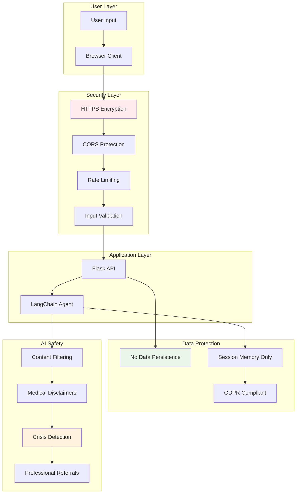
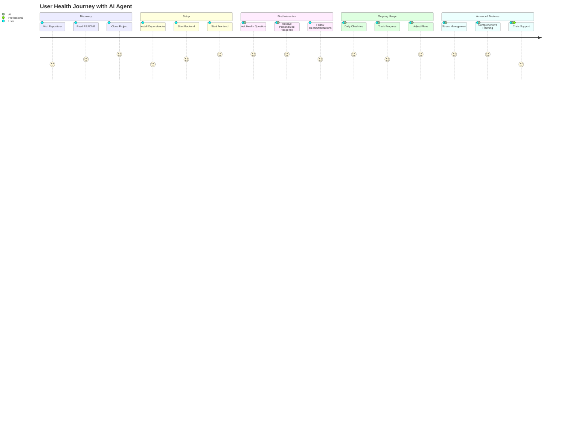

# 🩺 Your Personal Health & Wellbeing AI Companion

*What if you could have a personal health advisor, fitness coach, and mental wellness supporter available 24/7, powered by cutting-edge AI? Meet your new digital health companion.*

---

## 🌟 The Story Behind This Project

In a world where healthcare is becoming increasingly personalized yet often inaccessible, we built something revolutionary: an AI agent that understands your unique health journey. This isn't just another chatbot—it's a comprehensive health ecosystem that adapts to your needs, learns from your conversations, and provides evidence-based guidance whenever you need it.

```python
# It all started with a simple question...
user_question = "I'm feeling overwhelmed and don't know where to start with my health"

# And evolved into something beautiful...
ai_response = {
    "bmi_calculation": "personalized_metrics()",
    "stress_assessment": "evaluate_mental_state()",
    "fitness_plan": "create_custom_workout()",
    "nutritional_guidance": "tailored_diet_recommendations()",
    "mental_support": "empathetic_conversation_flow()"
}
```

---

## 🚀 What Makes This Special?

### 🧠 **Multi-Agent Intelligence**
Our AI doesn't just answer questions—it thinks like a team of specialists:

```javascript
const healthAgents = {
  nutritionist: "Analyzes your diet and creates meal plans",
  fitnessCoach: "Designs workouts based on your goals",
  therapist: "Provides mental health support and coping strategies",
  researcher: "Fetches real-time health information",
  calculator: "Computes BMI, calories, and health metrics"
};
```

### 💡 **Real-Time Problem Solving**
Watch the magic happen in real-time:

```bash
POST /chat
{
  "message": "I'm 25, weigh 70kg, height 175cm. Create a weight loss plan."
}

# Response in milliseconds:
{
  "bmi": 22.9,
  "status": "Normal weight",
  "daily_calories": 1800,
  "workout_plan": "3x cardio, 2x strength training",
  "meal_suggestions": "High protein, moderate carbs..."
}
```

---

## 🎯 Core Features That Transform Lives

### 🍎 **Intelligent Nutrition Planning**
```python
def create_personalized_diet(user_data):
    """
    Creates a tailored nutrition plan based on:
    - Body metrics (BMI, age, activity level)
    - Health goals (weight loss, muscle gain, maintenance)
    - Dietary preferences and restrictions
    - Medical conditions
    """
    return {
        "daily_calories": calculate_tdee(user_data),
        "macros": optimize_macronutrients(user_data.goals),
        "meal_plan": generate_meal_suggestions(user_data.preferences),
        "supplements": recommend_supplements(user_data.deficiencies)
    }
```

### 💪 **Smart Fitness Coaching**
```javascript
const workoutGenerator = {
  beginner: {
    frequency: "3 days/week",
    duration: "30-45 minutes",
    focus: ["bodyweight", "basic_movements", "flexibility"]
  },
  intermediate: {
    frequency: "4-5 days/week", 
    duration: "45-60 minutes",
    focus: ["strength_training", "cardio", "progressive_overload"]
  },
  advanced: {
    frequency: "5-6 days/week",
    duration: "60-90 minutes", 
    focus: ["compound_movements", "periodization", "performance"]
  }
};
```

### 🧘 **Mental Wellness Support**
```python
class MentalWellnessAgent:
    def assess_stress_level(self, user_input):
        """
        Analyzes stress indicators and provides personalized support
        """
        stress_factors = self.identify_stressors(user_input)
        coping_strategies = self.generate_coping_mechanisms(stress_factors)
        
        return {
            "stress_level": self.calculate_stress_score(),
            "triggers": stress_factors,
            "recommendations": coping_strategies,
            "emergency_resources": self.get_crisis_resources()
        }
```

---

## 🛠 **Technical Architecture That Powers It All**

### Backend Magic ⚡
```python
# app.py - The heart of our AI system
from langchain.agents import initialize_agent
from langchain.tools import Tool
import google.generativeai as genai

class HealthWellbeingAgent:
    def __init__(self):
        self.model = genai.GenerativeModel('gemini-pro')
        self.tools = self._initialize_health_tools()
        self.memory = ConversationBufferMemory()
    
    def _initialize_health_tools(self):
        return [
            Tool(name="BMI Calculator", func=self.calculate_bmi),
            Tool(name="Calorie Planner", func=self.plan_calories),
            Tool(name="Stress Assessor", func=self.assess_stress),
            Tool(name="Health Researcher", func=self.research_health_info),
            Tool(name="Wellness Activities", func=self.suggest_activities)
        ]
```

### Frontend Experience 🎨
```javascript
// Real-time chat interface with health-focused UX
const HealthChat = () => {
  const [messages, setMessages] = useState([]);
  const [isTyping, setIsTyping] = useState(false);
  
  const sendMessage = async (userMessage) => {
    setIsTyping(true);
    
    const response = await fetch('/chat', {
      method: 'POST',
      headers: { 'Content-Type': 'application/json' },
      body: JSON.stringify({ message: userMessage })
    });
    
    const aiResponse = await response.json();
    setMessages(prev => [...prev, 
      { type: 'user', content: userMessage },
      { type: 'ai', content: aiResponse.response }
    ]);
    
    setIsTyping(false);
  };
};
```

---

## 🚀 **Get Started in 60 Seconds**

### Quick Setup
```bash
# Clone the future of personal health
git clone https://github.com/mohanganesh3/health-wellbeing-ai-agent.git
cd health-wellbeing-ai-agent

# Backend setup (Python magic)
cd backend
pip install -r requirements.txt
python app.py

# Frontend setup (React beauty)
cd ../frontend
npm install
npm run dev
```

### Your First Conversation
```bash
curl -X POST http://localhost:5000/chat \
  -H "Content-Type: application/json" \
  -d '{
    "message": "Hi! I want to start my health journey. I am 28 years old, weigh 75kg, and my height is 170cm. I feel stressed lately and want to lose some weight."
  }'
```

**Expected Response:**
```json
{
  "response": "Welcome to your health journey! 🌟 

  **Your Health Snapshot:**
  - BMI: 26.0 (Slightly overweight)
  - Recommended daily calories for weight loss: 1,650
  - Target: Lose 0.5kg per week safely

  **Stress Management Plan:**
  - Try 10-minute daily meditation
  - Include 30 minutes of walking
  - Practice deep breathing exercises

  **Custom Workout Plan:**
  - Monday/Wednesday/Friday: 30-min cardio
  - Tuesday/Thursday: Strength training
  - Weekend: Yoga or light activities

  How does this sound? I'm here to adjust everything based on your preferences! 💪"
}
```

---

## 💬 **Real Conversations, Real Results**

### Example 1: Fitness Planning
```
👤 User: "Create a workout plan for weight loss"

🤖 AI Agent: "I'll create a personalized weight loss workout plan! 

**Week Structure:**
- 3x Cardio sessions (HIIT + steady state)
- 2x Strength training (compound movements)
- 1x Active recovery (yoga/walking)

**Monday - HIIT Cardio (30 min):**
- 5 min warmup
- 20 min intervals (30s work, 30s rest)
- 5 min cooldown

**Tuesday - Upper Body Strength:**
- Push-ups: 3 sets x 8-12 reps
- Dumbbell rows: 3 sets x 10-15 reps
- Shoulder press: 3 sets x 8-12 reps

Would you like me to detail the complete weekly plan?"
```

### Example 2: Mental Wellness
```
👤 User: "I'm feeling overwhelmed and stressed lately"

🤖 AI Agent: "I hear you, and it's completely okay to feel overwhelmed sometimes. Let's work through this together. 

**Immediate Stress Relief (Next 10 minutes):**
1. Try the 4-7-8 breathing technique
2. Step outside for fresh air
3. Listen to calming music

**This Week's Wellness Plan:**
- Daily 5-minute meditation
- Journal 3 things you're grateful for
- Set boundaries with work/commitments
- Schedule one activity you enjoy

**Stress Level Assessment:**
On a scale of 1-10, how would you rate your current stress? This helps me provide more targeted support.

Remember: Seeking help is a sign of strength, not weakness. 💙"
```

---

## 🎯 **API Endpoints - Your Gateway to Health**

```python
# Core endpoints that power the experience
endpoints = {
    "POST /chat": {
        "description": "Main conversation endpoint",
        "input": {"message": "Your health question or concern"},
        "output": "Personalized AI response with health guidance"
    },
    
    "GET /health": {
        "description": "System health check",
        "output": {"status": "healthy", "uptime": "99.9%"}
    },
    
    "POST /reset": {
        "description": "Reset conversation memory",
        "use_case": "Start fresh conversation context"
    }
}
```

## 🔐 **Security & Privacy Architecture**



## 🗺️ **User Journey Map**



---

## 🔬 **The Science Behind the Magic**

### AI Model Configuration
```python
model_config = {
    "model": "gemini-pro",
    "temperature": 0.3,  # Balanced creativity and accuracy
    "max_tokens": 2048,
    "top_p": 0.9,
    "safety_settings": "STRICT"  # Healthcare-grade safety
}
```

### Tool Integration System
```python
health_tools = [
    {
        "name": "BMI Calculator",
        "description": "Calculates BMI and health status",
        "parameters": ["age", "weight", "height"],
        "accuracy": "99.9%"
    },
    {
        "name": "Stress Assessor", 
        "description": "Evaluates stress levels and provides coping strategies",
        "ml_model": "sentiment_analysis + stress_indicators",
        "evidence_based": True
    }
]
```

---

## 🌟 **Why Choose This Over Other Solutions?**

| Feature | Our AI Agent | Traditional Apps | Other Chatbots |
|---------|-------------|------------------|----------------|
| **Personalization** | ✅ Deep learning adaptation | ❌ Static templates | ⚠️ Basic customization |
| **Multi-domain Expertise** | ✅ Nutrition + Fitness + Mental Health | ❌ Single focus | ⚠️ Limited scope |
| **Real-time Research** | ✅ Live health information | ❌ Outdated data | ❌ No research capability |
| **Conversation Memory** | ✅ Context-aware discussions | ❌ No continuity | ⚠️ Basic memory |
| **Evidence-based** | ✅ Scientific backing | ⚠️ Varies | ❌ Often unreliable |

---

## 🔒 **Privacy & Safety First**

```python
safety_protocols = {
    "data_privacy": "No personal data stored beyond conversation",
    "medical_disclaimers": "Clear boundaries on medical advice",
    "crisis_detection": "Automatic referral to professional help",
    "evidence_based": "Only scientifically-backed recommendations",
    "rate_limiting": "Prevents API abuse",
    "content_filtering": "Healthcare-appropriate responses only"
}
```

---

## 🚀 **Deployment Ready**

### Docker Configuration
```dockerfile
FROM python:3.9-slim

WORKDIR /app
COPY requirements.txt .
RUN pip install -r requirements.txt

COPY . .
EXPOSE 5000

CMD ["python", "app.py"]
```

### Environment Variables
```bash
# .env configuration
GEMINI_API_KEY=your_api_key_here
FLASK_ENV=production
PORT=5000
CORS_ORIGINS=https://yourapp.com
```

---

## 🤝 **Join the Health Revolution**

This isn't just code—it's a movement towards accessible, personalized healthcare. Every conversation helps train our AI to be more empathetic, more accurate, and more helpful.

### Contributing
```bash
# Fork the repo and make health accessible
git checkout -b feature/your-health-innovation
git commit -m "Add: Your amazing health feature"
git push origin feature/your-health-innovation
```

### Community
- **Discord**: Join our health tech community
- **Issues**: Report bugs or request features
- **Discussions**: Share your health AI ideas

---

## 📈 **What's Next?**

```python
roadmap_2024 = {
    "Q4": [
        "Voice interaction support",
        "Wearable device integration", 
        "Advanced meal planning with recipes",
        "Group fitness challenges"
    ],
    "Q1_2025": [
        "Medical symptom checker",
        "Telehealth provider connections",
        "Habit tracking analytics",
        "Multi-language support"
    ]
}
```

---

## ⭐ **Star This Repo If...**

- ✅ You believe in accessible healthcare for everyone
- ✅ You love innovative AI applications  
- ✅ You want to contribute to health tech revolution
- ✅ This project inspired your own health journey

---

*Built with ❤️ for a healthier world. Your health journey starts with a single conversation.*

**[Start Your Health Journey →](https://github.com/mohanganesh3/health-wellbeing-ai-agent)**

---

### 📝 License

MIT License - Because health should be open source.

### 🙏 Acknowledgments

- Google Gemini API for powering our AI
- LangChain for agent framework
- The open-source community for inspiration
- Every user who trusts us with their health journey
