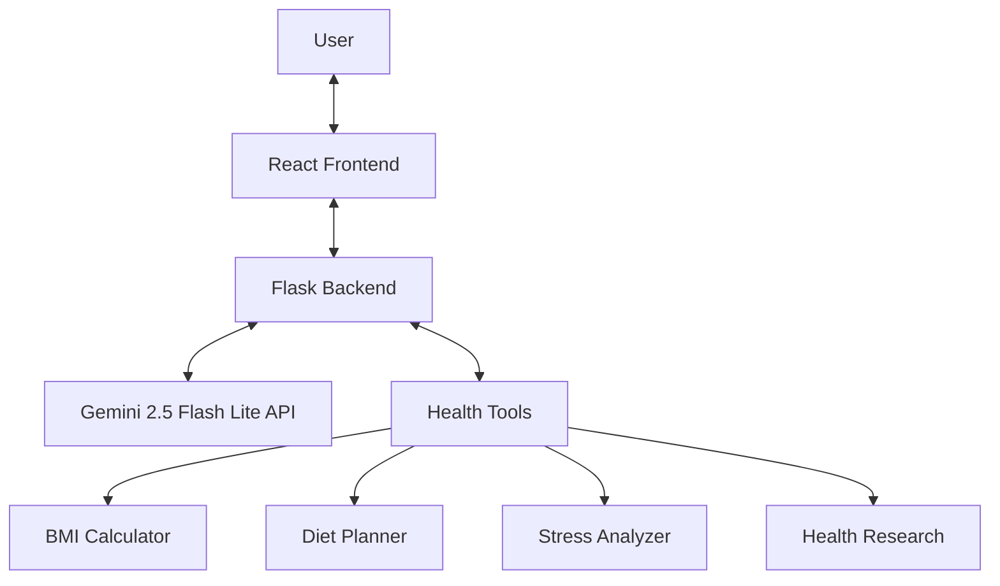

# 🌿 Health & Wellbeing AI Assistant: My Journey

## 🚀 The Project Evolution

Welcome to my development journey! I've created a comprehensive AI-powered health and wellbeing assistant that combines cutting-edge technology with practical health guidance. This blog documents my experience building this application from concept to completion.

)

## 💡 What I Built

I developed a full-stack application that leverages Google's Gemini AI to provide personalized health and wellbeing guidance. The system combines:

### 🧠 AI-Powered Health Assistant
- **Personalized Health Guidance**: Custom recommendations based on user needs
- **Mental Wellbeing Support**: Empathetic responses for emotional health
- **Fitness & Nutrition Planning**: Tailored workout and diet suggestions
- **Health Calculations**: BMI, calorie needs, and other health metrics

### 🛠️ Technical Architecture



## 🔧 Technical Challenges & Solutions

### Challenge 1: API Integration
Initially, I struggled with configuring the Google Gemini API correctly. After several attempts, I implemented a secure environment variable approach using python-dotenv to manage API keys safely.

### Challenge 2: Model Selection
I started with the gemini-pro model but later upgraded to gemini-1.5-pro for better performance. Most recently, I've implemented the cutting-edge gemini-2.5-flash-lite model for faster responses while maintaining quality.

### Challenge 3: Error Handling
Implementing robust error handling for API rate limits and connection issues was crucial for a smooth user experience. I added comprehensive try-except blocks and user-friendly error messages.

## 📊 Results & Learnings

### What Worked Well
- The modular architecture made it easy to add new health tools
- React's state management handled conversation flow seamlessly
- Environment variables provided secure API key management

### Future Improvements
- Add user authentication for personalized experiences
- Implement data persistence for tracking progress over time
- Expand the tool system with more specialized health calculators

## 🧪 Try It Yourself

### Quick Setup

1. **Backend Setup**
```bash
cd backend
pip install -r requirements.txt
python app.py
```

2. **Frontend Setup**
```bash
npm install
npm run dev
```

3. **Access the Application**
- Backend: http://localhost:5001
- Frontend: http://localhost:8080

### Example Prompts

- "Calculate my BMI: I'm 30 years old, 175cm tall, and weigh 70kg"
- "I'm feeling stressed about work. What can I do?"
- "Create a beginner's workout plan for weight loss"
- "How many calories should I eat daily as a 25-year-old active female?"

## 🔮 What's Next

I'm continuously improving this project with new features and optimizations. Stay tuned for:

- Voice interaction capabilities
- Mobile app version
- Integration with wearable health devices
- Expanded mental health resources

Thank you for following my development journey! Feel free to contribute or provide feedback on this exciting health tech project.
