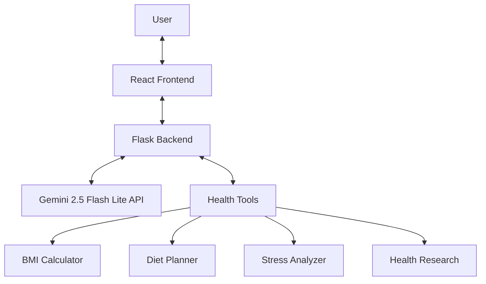

# 🌿 Health & Wellbeing AI Assistant: My Journey

## 🚀 The Project Evolution: Building a Smarter Health Companion

Welcome to my development journey! In this deep dive, I'll walk you through the creation of a comprehensive AI-powered health and wellbeing assistant. This project isn't just about code; it's about leveraging cutting-edge technology to provide practical, personalized health guidance and support. Join me as I document my experience building this application from concept to completion, sharing insights, challenges, and solutions along the way.

### Visualizing the Architecture

To truly understand how this intelligent assistant works, let's visualize its core components and their interactions:

)

This diagram illustrates the flow: users interact with the React frontend, which communicates with the Flask backend. The backend, in turn, orchestrates interactions with the Gemini AI and a suite of specialized health tools.

## 💡 What I Built: A Holistic Approach to Wellness

I developed a full-stack application that leverages Google's Gemini AI to provide personalized health and wellbeing guidance. The system is designed to be a comprehensive resource, combining:

### 🧠 The AI-Powered Health Assistant: Your Intelligent Guide

At the heart of this project is an AI assistant capable of understanding your needs and providing tailored advice:

-   **Personalized Health Guidance**: Custom recommendations based on your unique needs and queries.
-   **Mental Wellbeing Support**: Empathetic and supportive responses for emotional health, offering coping strategies and resources.
-   **Fitness & Nutrition Planning**: Tailored workout routines and diet suggestions to help you achieve your physical goals.
-   **Health Calculations**: Instant calculations for BMI, calorie needs, and other vital health metrics.

### 🛠️ Diving Deeper: The Technical Architecture

Let's break down the technical backbone of this application:



This architecture ensures a clear separation of concerns, allowing for scalable and maintainable development. The React frontend handles the user interface, while the Flask backend acts as the brain, processing requests, interacting with the Gemini API, and utilizing various specialized tools.

## 🔧 Technical Challenges & My Solutions

Building this application came with its share of exciting challenges. Here's how I tackled some of the most significant ones:

### Challenge 1: Seamless API Integration

Integrating with the Google Gemini API required careful handling of authentication and requests. My solution involved implementing a secure environment variable approach using `python-dotenv` to manage API keys safely, preventing them from being exposed in the codebase.

### Challenge 2: Optimal Model Selection

Choosing the right AI model was crucial for performance and accuracy. I started with `gemini-pro`, then upgraded to `gemini-1.5-pro` for enhanced capabilities. Most recently, I've implemented the cutting-edge `gemini-2.5-flash-lite` model, striking a balance between faster responses and maintaining high-quality interactions.

### Challenge 3: Robust Error Handling

Ensuring a smooth user experience meant anticipating and handling potential issues like API rate limits and connection problems. I implemented comprehensive `try-except` blocks throughout the backend and designed user-friendly error messages for the frontend, guiding users when issues arise.

## 📊 Results & Learnings: What I Discovered

This project provided invaluable learning experiences:

### What Worked Well

-   **Modular Architecture**: The clear separation of frontend and backend, along with the tool-based approach, made it incredibly easy to add new health tools and features without disrupting existing functionality.
-   **React's State Management**: React's efficient state management handled the dynamic conversation flow seamlessly, ensuring a responsive and interactive chat experience.
-   **Secure Environment Variables**: The use of environment variables proved to be an effective and secure method for managing sensitive API keys.

### Future Improvements: The Road Ahead

I'm continuously looking for ways to enhance this AI assistant:

-   **User Authentication**: Implementing user authentication for personalized experiences, allowing users to save their progress and preferences.
-   **Data Persistence**: Adding data persistence to track user progress over time, providing long-term insights and support.
-   **Expanded Tool System**: Integrating more specialized health calculators and external APIs to broaden the agent's capabilities.

## 🧪 Try It Yourself: Get Hands-On!

Ready to experience your personal AI health companion? Follow these simple steps to set up the project locally and start your journey to wellness.

### Quick Setup Guide

Before you begin, ensure you have the following installed on your system:

-   **Node.js** (LTS version recommended)
-   **Python 3.9+**
-   **npm** or **yarn**
-   A **Google Gemini API Key** (You can obtain one from the [Google AI Studio](https://aistudio.google.com/)).

#### 1. Clone the Repository

Start by cloning the project to your local machine:

```bash
git clone https://github.com/mohanganesh3/health-wellbeing-ai-agent.git
cd health-wellbeing-ai-agent
```

#### 2. Backend Configuration & Launch

Navigate into the `backend` directory, set up your Python environment, and launch the Flask server:

```bash
cd backend
pip install -r requirements.txt
python app.py
```

**Important**: Create a `.env` file in the `backend` directory and add your Google Gemini API Key. **Never commit this file to version control!**

```
GOOGLE_API_KEY="YOUR_GEMINI_API_KEY"
```

#### 3. Frontend Configuration & Launch

Open a **new terminal** (leave the backend running) and navigate back to the project root directory. Install Node.js dependencies and start the React development server:

```bash
cd .. # If you are still in the backend directory
npm install # or yarn install
npm run dev # or yarn dev
```

Your AI Health & Wellbeing Agent will now be accessible in your web browser at `http://localhost:5173` (or an alternative port if 5173 is already in use).

## 💬 How to Use: Start Your Conversation

With both the backend and frontend servers running, simply open your web browser to the frontend URL. Type your health, fitness, or mental wellbeing questions into the chat interface, and let your AI companion guide you. Here are some example prompts to get you started:

-   "Calculate my BMI: I'm 30 years old, 175cm tall, and weigh 70kg"
-   "I'm feeling stressed about work. What can I do?"
-   "Create a beginner's workout plan for weight loss"
-   "How many calories should I eat daily as a 25-year-old active female?"

## 🤝 Contributing to a Healthier Future

I welcome contributions to enhance this AI agent! Whether it's adding new features, improving existing tools, or refining the UI, your input is valuable. Please feel free to open issues or submit pull requests on GitHub.

## 📄 License

This project is open-source and available under the MIT License. See the [LICENSE](LICENSE) file for more details.
